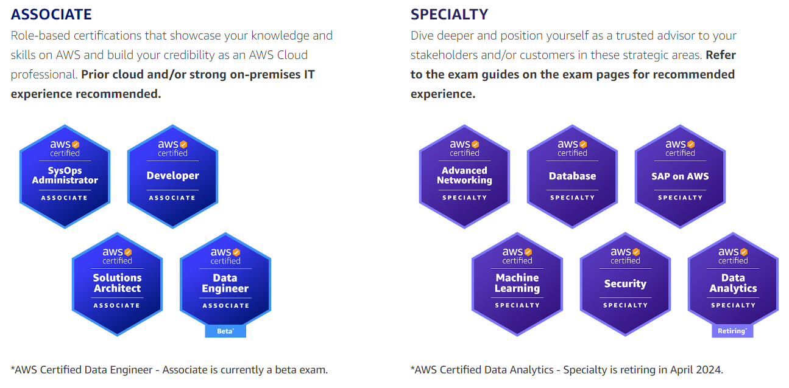

## Dedicated repository for notes and topics regarding AWS services

In this repository, I write summaries of the services offered by AWS with the aim of creating training materials and enhancing understanding of the services. All to improve Cloud skills and achieve AWS certifications

I partitioned this repository into modules for each certification, for example:

 FOUNDATIONAL
  - Cloud Practitioner

 PROFESSIONAL
  - Solutions Architect
  - DevOps Engineer

 ASSOCIATE
  - SysOps Administrator
  - Developer
  - Solution Architect
  - Data Engineer

 SPECIALTY
  - Advanced Networking
  - Database
  - SAP on AWS
  - Machine Learning
  - Security
  - Data Analytics

obs: note that this list may be subject to deprecation as AWS certifications undergo regular updates and changes.

AWS Certifications: https://aws.amazon.com/certification/?gclid=CjwKCAiA4smsBhAEEiwAO6DEjZjpVEbX8xEqcdBmST5mXzlRwCkm2g-ap9xtDlhFKvDRWAFafsVyUBoCWZEQAvD_BwE&trk=0c2b5279-1e50-459b-b9b5-6b0861ac160e&sc_channel=ps&ef_id=CjwKCAiA4smsBhAEEiwAO6DEjZjpVEbX8xEqcdBmST5mXzlRwCkm2g-ap9xtDlhFKvDRWAFafsVyUBoCWZEQAvD_BwE:G:s&s_kwcid=AL!4422!3!653411797890!e!!g!!aws%20certifications!19919601960!149404862324